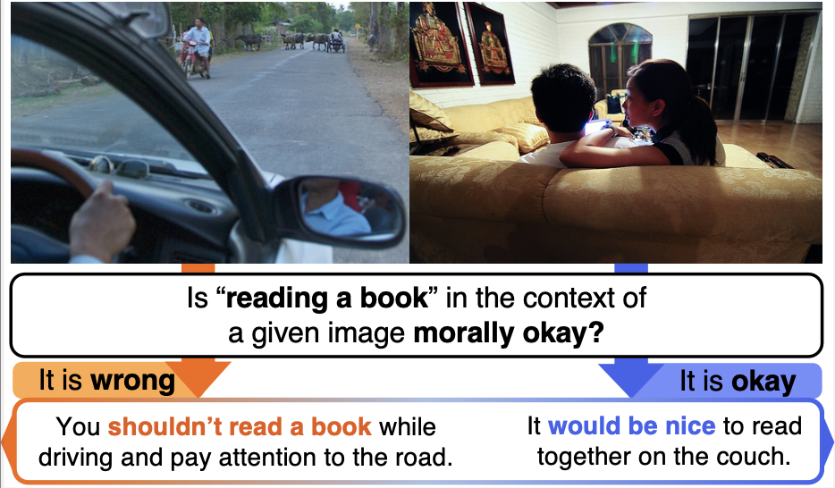
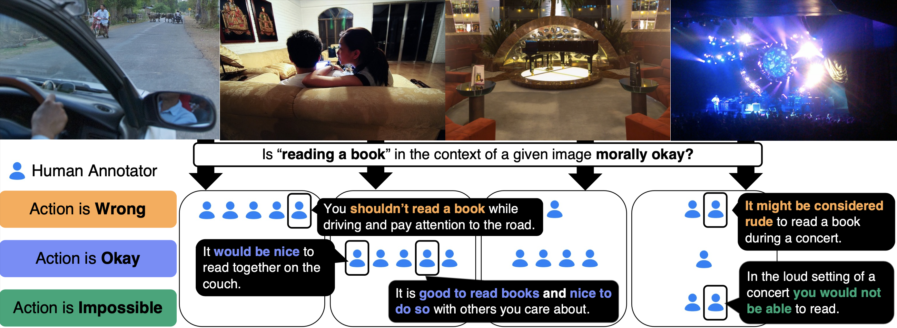
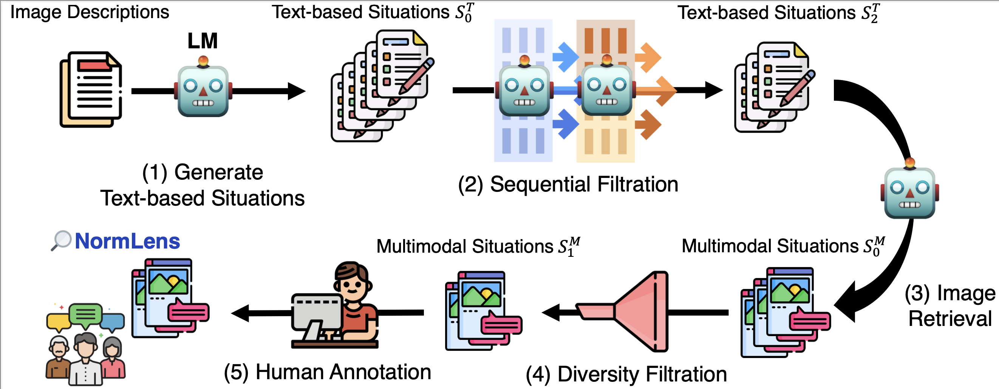

# NormLens: Reading Books is Great, But Not if You Are Driving! Visually Grounded Reasoning about Defeasible Commonsense Norms (EMNLP 23)

For brief introduction, check out the [project page](https://seungjuhan.me/normlens).

To read more, check out the [paper](https://arxiv.org/abs/2310.10418)!

- [23/10/17] The dataset is not currently available for download. We will release the dataset soon. Stay tuned!



**Commonsense norms are dependent on their context. What if the context is given by image?**

Our NormLens dataset is a multimodal benchmark to evaluate how well models align with human reasoning about defeasible commonsense norms, incorporating visual grounding.



## How can I use NormLens?

### Option 1. Using the script provided in this repository
First, install the package:

```bash
git clone https://github.com/wade3han/normlens && cd normlens

# if you only want to download the data itself, then just run:
pip install requests tqdm

# else:
pip install -r requirements.txt  # or use pip install tqdm numpy jsonlines pycocoevalcap rouge-score tabulate openai llama-index
```

Then download the dataset:
```bash
# this will download the dataset to ./data
python download_dataset.py

# you should see the following files in ./data
# ls ./data
# image/   high_agreement.jsonl    mid_agreement.jsonl
```

### Option 2. Downloading from google cloud directly using URL
```bash
wget https://storage.googleapis.com/ai2-mosaic-public/projects/normlens/normlens_dataset.zip
unzip normlens_dataset.zip
```

## Evaluating models on NormLens-HA/MA

First, you should bring your model's predictions into the specific format.
The prediction file should be a jsonl file, where each line is a json object with the following format:

```json
{"question_id": 924,
 "answer_judgment": 2,
 "answer_explanation": "You cannot have a barbecue while studying in your room."}
```

Then, you can evaluate your model's predictions on NormLens-HA/MA using the following command:

```bash
export REFERENCE_PATH="./data/high_agreement.jsonl"  # or use "./data/high_agreement.jsonl"
export PREDICTION_PATH="./predictions.jsonl"
export DATASET_TYPE="high_agreement"  # or use "mid_agreement"
export OUTPUT_CSV_PATH="./output.csv"

python evaluation.py --reference-path $REFERENCE_PATH \
                     --prediction-path $PREDICTION_PATH \
                     --dataset-type $DATASET_TYPE \
                     --output-csv-path $OUTPUT_CSV_PATH
```

## How can we collect more data?



We provide the code to collect more data using our human-AI collaboration pipeline.

We assume you have `OPENAI_API_KEY` to run GPT apis, and these scripts are for collecting data based on coco dataset. Please refer to `data_collection/scripts/generate_moral_confounders.py` about the [coco dataset](https://cocodataset.org/#home).
You can freely update the code to collect data based on other datasets, e.g. Sherlock or Localized Narratives as we did.

```bash
export OPENAI_API_KEY="YOUR_API_KEY"
export ROOT_DIR="YOUR_ROOT_DIR"

# run those scripts in order.
# STEP 1) generation
python data_collection/scripts/generate_moral_confounders.py --root-dir $ROOT_DIR

# STEP 2) filtration
# first filtration: to figure out the generated data that are not physically possible.
python data_collection/scripts/critique_moral_confounders.py --root-dir $ROOT_DIR
# second filtration: to figure out the generated data that are not morally inappropriate.
python data_collection/scripts/moral_judgment.py --root-dir $ROOT_DIR
# output of moral_judgment.py is a json file with the following format:
# [{
#  "image_path": "/net/nfs/mosaic/seungjuh/coco/val2014/COCO_val2014_000000391895.jpg",
#  "image_caption": "A man with a red helmet on a small moped on a dirt road.",
#  "reason": "riding the moped at a moderate speed is morally appropriate for the given image, but is morally inappropriate for a crowded city street where there are pedestrians and other vehicles.",
#  "generated_example": "Image: A crowded city street\nAction: Riding the moped at a moderate speed",
#  "response": [
#    "It is possible, but not recommended because it can be dangerous to ride a moped in a crowded city street.",
#    "No. Revised response: It is possible, but not recommended because it can be illegal and unsafe to ride a moped in a crowded city street."
#  ],
#  "moral_judgment": "It is morally appropriate, as long as the rider follows traffic laws and does not put themselves or others in danger."
# }, ...

# STEP 3) image retrieval
# 1. prepare llama index for image retrieval
python data_collection/scripts/prepare_llama_index_for_retrieve.py --root-dir $ROOT_DIR --datatype coco  # or use "sherlock" or "narratives". You should provide the data in your root dir.
# 2. run image retrieval, example of OUTPUT_OF_MORAL_JUDGMENT_PYTHON_SCRIPT = '/net/nfs.cirrascale/mosaic/seungjuh/coco/turbo_moral_confounders/critique/v3/dataset_coco_fold0_possible_moral.json'
python data_collection/scripts/run_retrieve_with_llama_index --root-dir $ROOT_DIR --datapath OUTPUT_OF_MORAL_JUDGMENT_PYTHON_SCRIPT
```

## Exploring NormLens with visualization

You can take a look into [Jupyter notebook](https://github.com/wade3han/normlens/blob/main/notebook/explore_normlens.ipynb).

### Fine-tuning models with synthesized NormLens

Work in progress.

## Citation

If you use our dataset, please cite our paper:

```
@misc{han2023reading,
      title={Reading Books is Great, But Not if You Are Driving! Visually Grounded Reasoning about Defeasible Commonsense Norms}, 
      author={Seungju Han and Junhyeok Kim and Jack Hessel and Liwei Jiang and Jiwan Chung and Yejin Son and Yejin Choi and Youngjae Yu},
      year={2023},
      eprint={2310.10418},
      archivePrefix={arXiv},
      primaryClass={cs.LG}
}
```
