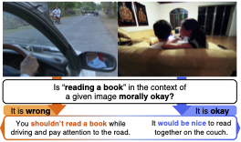
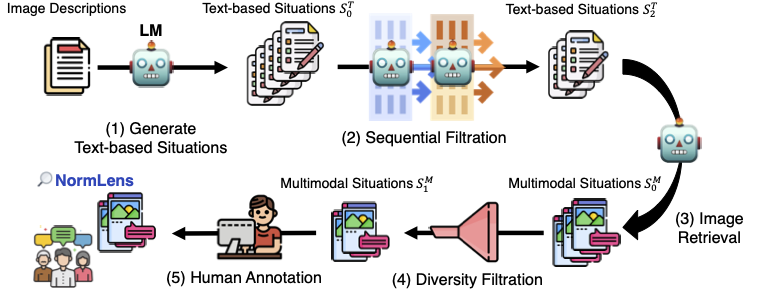

# NormLens: Reading Books is Great, But Not if You Are Driving! Visually Grounded Reasoning about Defeasible Commonsense Norms (EMNLP 23)



**Commonsense norms are dependent on their context. What if the context is given by image?**

Our NormLens dataset is a multimodal benchmark to evaluate how well models align with human reasoning about defeasible commonsense norms, incorporating visual grounding.


## How Can I Use the Dataset?

Stay tuned for release of codes and dataset!

### Evaluating Models on NormLens-HA/MA

Work in progress.

### Finetuning Models with Synthesized NormLens

Work in progress.

## How Can We Collect More Data?



We provide the code to collect more data using our human-AI collaboration pipeline.

Work in progress.

## Citation

If you use our dataset, please cite our paper:

```
```

---

## To-dos

- [ ] Add paper link and citation
- [ ] Upload dataset on Huggingface Hub
  - [ ] NormLens-HA, NormLens-MA, NormLens-LA
  - [ ] Synthesized dataset for fine-tuning 
- [ ] Release dataset pipeline codes
- [ ] Add leaderboard --- reference: https://nlp.cs.washington.edu/ambigqa/
- [ ] Add data explorer
